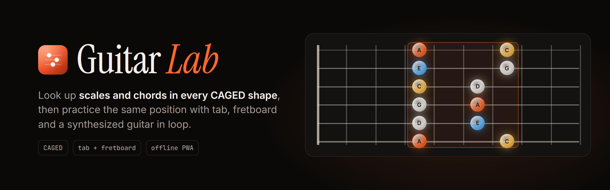
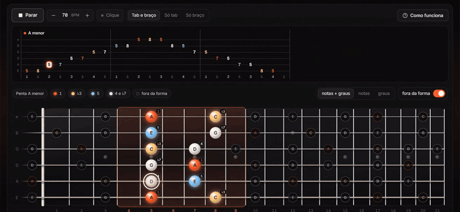
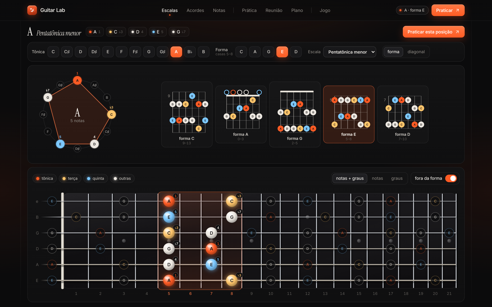
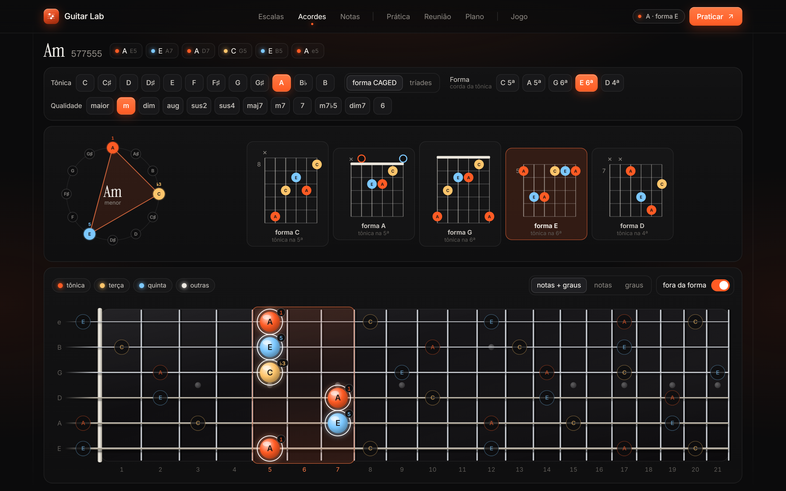
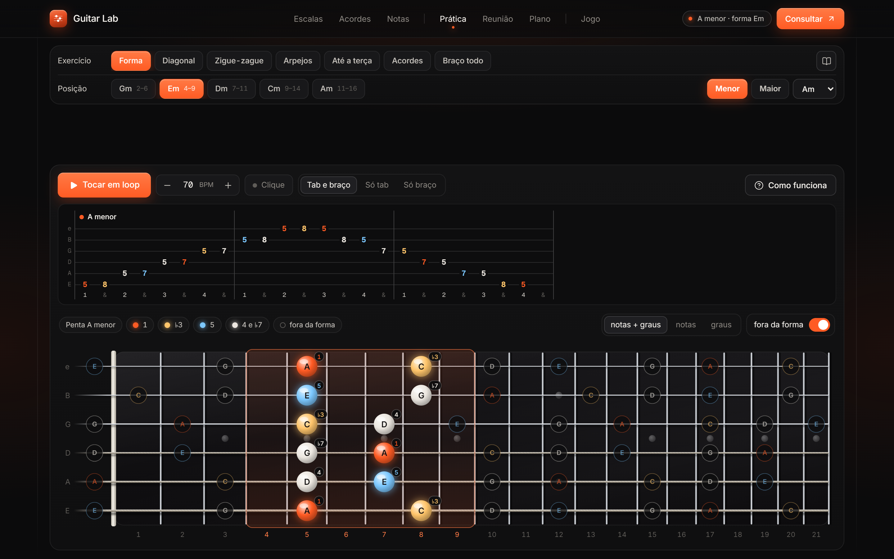
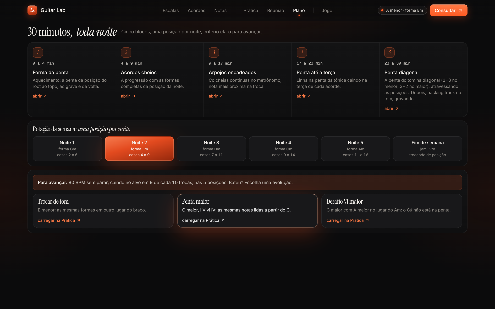
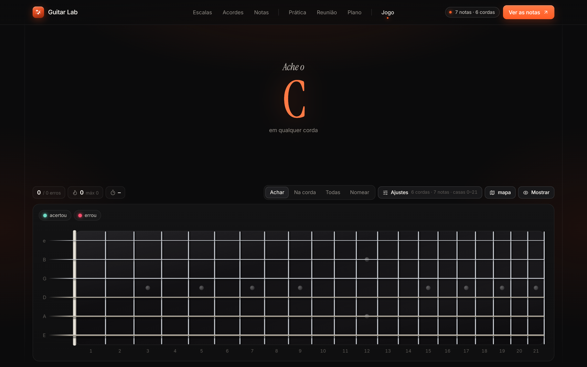
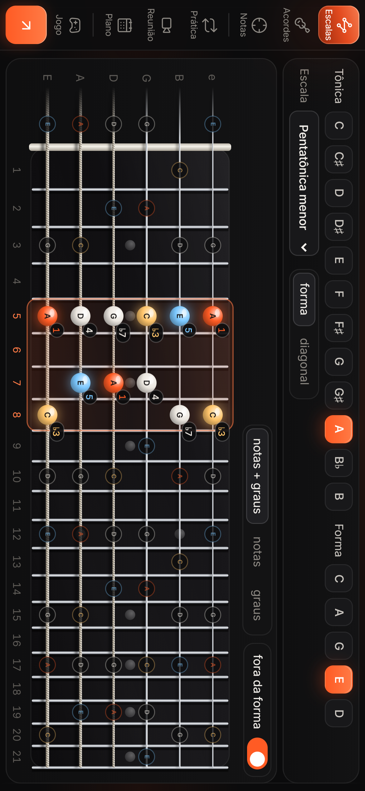

<div align="center">

<picture>
  <source media="(prefers-color-scheme: dark)" srcset=".github/assets/banner-dark.png">
  <source media="(prefers-color-scheme: light)" srcset=".github/assets/banner-light.png">
  
</picture>

<br>


<br><br>

**Fretboard reference and guitar practice in one PWA.**<br>
Look up a scale in a CAGED shape, then practice that exact position with tab, fretboard and a synthesized guitar in loop.

[Screenshots](#screenshots) · [How it fits together](#how-it-fits-together) · [Getting started](#getting-started)

<br>



</div>

> [!NOTE]
> The interface is in Brazilian Portuguese. Note names, degrees, tab and the fretboard
> read the same in any language.

## Screenshots



<table>
  <tr>
    <td width="50%"></td>
    <td width="50%"></td>
  </tr>
  <tr>
    <td align="center"><b>Chords</b> · every quality in the five shapes, or as triads</td>
    <td align="center"><b>Practice</b> · seven exercises per position, with BPM and click</td>
  </tr>
  <tr>
    <td width="50%"></td>
    <td width="50%"></td>
  </tr>
  <tr>
    <td align="center"><b>Plan</b> · 30 minutes a night, one position per night</td>
    <td align="center"><b>Game</b> · find and name notes against the clock</td>
  </tr>
</table>

<details>
<summary><b>On a phone</b></summary>
<br>
<p align="center"></p>
</details>

## What is inside

| Half          | Screens                                                                                                   |
| ------------- | --------------------------------------------------------------------------------------------------------- |
| **Reference** | **Scales** in a CAGED shape with the chord on top and the harmonic field, **Chords** in the five shapes, and the **Notes** map |
| **Practice**  | **Practice** with the position's exercises in tab and on the fretboard, a looping synthesized guitar, BPM and click; the silent **drills**; and the 30-minute nightly **Plan** |
| **Game**      | Find a note, find it on one string, find them all, or name the note you see                               |

No backend: the site is static, and your choices live in the browser's `localStorage`
(`guitarlab:settings`).

## How it fits together

- **One root and one shape.** Picking A in the E shape under Scales opens Practice in A,
  in the E-shape position, and back. The shape is named after the root's chord (in minor:
  Em, Dm, Cm, Am, Gm). The scale box and the practice position land in the same place in
  all 120 combinations; the only difference is that Practice never uses open strings, so
  open boxes show up an octave higher.
- **One fretboard.** `components/Fretboard.tsx` draws every screen: glass spheres in three
  intensities (lit, subtle, ghost), the target-note ring, the five positions side by side
  and the note that is sounding.
- **One color per role.** Root orange, third amber, fifth blue, everything else white
  (`lib/roles.ts`), in scales, chords, exercises and drills. Degrees are written the same
  way everywhere: 1, ♭3, 5.
- **One spelling.** Note names follow the key (D♭ major, C♯ minor), and seven-note scales
  use each letter once (`lib/spelling.ts`).
- **Bridges.** "Practice this position" goes from a scale to practice; "See the scale"
  goes back. The orange button at the top does the same from any screen.

<details>
<summary><b>Theory and audio code</b></summary>

<br>

- `lib/fretboard.ts`, `lib/chords.ts`, `lib/harmony.ts` and `lib/notes.ts`: fretboard
  geometry, chord shapes, harmonic fields and note math.
- `lib/practice/caged.ts` and `lib/practice/session.ts`: positions, full shapes, chained
  arpeggios, pentatonic lines landing on the third, the diagonal pentatonic and the
  whole-neck arpeggio. `lib/practice/drills.ts` has the drills and `lib/practice/plan.ts`
  the plan.
- `lib/practice/audio.ts`: a Karplus-Strong guitar with Web Audio, muting each note on the
  next one.

</details>

## Design

A dark, warm design system: nearly all black, serif titles (Instrument Serif) with one
word in italics, small gray Inter for text, and a single orange accent in three
intensities (the dot, the fill and the glass highlight). Thin vertical lines mark the
content column. Tokens live in `app/globals.css`.

## Getting started

```bash
npm install
npm run dev
```

It is a PWA: `app/manifest.ts` is the manifest, icons are generated from `icons/*.svg` with
`node icons/build-icons.mjs`, and `public/sw.js` (network first for pages, cache first for
`/_next/static`) only registers in production builds.

## Stack

| Layer     | Technology                                       |
| --------- | ------------------------------------------------ |
| App       | Next.js 16 (App Router), React 19, TypeScript    |
| Audio     | Web Audio (Karplus-Strong synthesis)             |
| Icons     | Lucide                                           |
| Storage   | `localStorage`, no backend                       |

## License

[MIT](LICENSE)

<br>

<div align="center">
<sub>Built by <a href="https://github.com/megomes">Matheus Ervilha</a> for 30 minutes of guitar every night.</sub>
</div>
